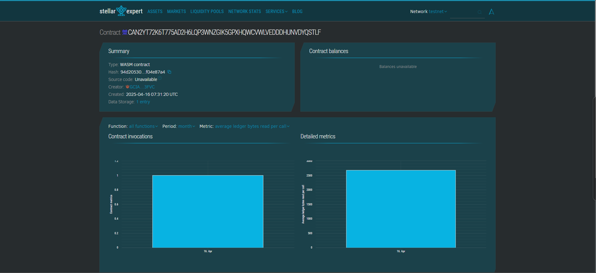

# Tokenized Community Garden

## 📌 Project Title
**84. Tokenized Community Garden**

## 📄 Project Description
A decentralized platform that allows individuals in a community to claim, manage, and track garden plots using blockchain. Each plot is tokenized as a digital asset and can be associated with crop types and owners.

## 🌍 Project Vision
To empower communities through sustainable agriculture and transparent digital ownership. By tokenizing garden plots, we aim to encourage urban farming, promote local food systems, and reward active gardeners.

## 🚀 Key Features
- **Plot Claiming**: Community members can claim a garden plot on-chain.
- **Ownership Tracking**: Every plot is linked to an individual via their blockchain address.
- **Crop Management**: Track the crop planted and time of planting for each plot.
- **Transparency**: Easily view and verify who owns which plot and what is being grown.

## 🔧 Contract Details

### Contract Address: CAN2YT72K6T775AD2H6LQP3WNZGIK5GPXHQWCVWLVEDDDHUNVDYQSTLF

### Functions:

1. `claim_plot(owner: Address, crop_type: String) -> u64`
   - Allows a user to claim a garden plot and specify the crop to be planted.

2. `get_plot(plot_id: u64) -> Plot`
   - Returns the plot's details such as owner, crop type, and planting time.

3. `get_plot_count() -> u64`
   - Returns the number of plots created/claimed so far.

### Storage:
- `GardenKey::Plot(id)`: Maps a plot ID to its associated data.
- `GardenKey::Count`: Stores the total number of plots.

---

Built with 🌱 using Soroban SDK.
